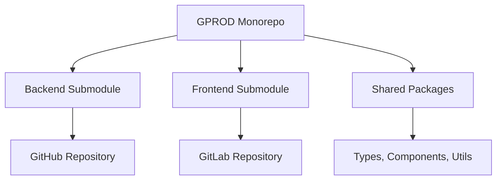

<div align="center">

# 🚀 GPROD Monorepo

*Unified enterprise-grade repository for GPROD ecosystem*

[](https://github.com/TheMacroeconomicDao/gprod-monorepo/actions)
[](https://opensource.org/licenses/MIT)
[](https://nodejs.org/)
[](https://pnpm.io/)
[](https://www.typescriptlang.org/)

[](https://api.gprod.build.infra.gyber.org)
[](https://api.stage.gprod.build.infra.gyber.org)
[](https://api.dev.gprod.build.infra.gyber.org)

<p align="center">
  <a href="#-tech-stack">Tech Stack</a> •
  <a href="#-quick-start">Quick Start</a> •
  <a href="#-deployment">Deployment</a> •
  <a href="#-architecture">Architecture</a> •
  <a href="#-contributing">Contributing</a>
</p>

</div>

---

## 📊 Project Overview

**GPROD** is a enterprise-grade monorepo built for scalable microservices architecture. Combining powerful backend APIs with modern frontend interfaces, all unified under robust CI/CD pipelines and Kubernetes orchestration.

### 🎯 Key Features

- 🔥 **Monorepo Architecture** - Unified development workflow
- 🚀 **Microservices Ready** - Scalable backend with NestJS
- ⚡ **Modern Frontend** - React with Feature-Sliced Design
- 🔐 **Enterprise Security** - JWT auth, SSL certificates, role-based access
- 🐳 **Containerized** - Docker & Kubernetes native
- 📦 **Shared Packages** - Reusable components and utilities
- 🔄 **Multi-Environment** - Dev, Staging, Production ready
- 📈 **Monitoring & Health Checks** - Built-in observability

## 🛠️ Tech Stack

<div align="center">

### Backend


### Frontend


### DevOps & Infrastructure


### Package Management


</div>

## 🏗️ Project Structure

```
📁 gprod-monorepo/
├── 📱 apps/
│   ├── 🔧 backend/          # NestJS API (Git Submodule)
│   └── 🎨 frontend/         # React SPA (Git Submodule)
├── 📦 packages/             # Shared libraries
│   ├── 🔗 shared-types/     # Common TypeScript interfaces
│   ├── 🧩 ui-components/    # Reusable UI components
│   └── 🛠️ utils/           # Utility functions
├── 🔧 tools/               # Development tooling
├── ⚙️ .github/workflows/   # CI/CD pipelines
├── 🐳 docker-compose.yml   # Local development
└── 📚 docs/               # Documentation
```

## ⚡ Quick Start

### Prerequisites


### 🚀 Installation

```bash
# 1️⃣ Clone the monorepo
git clone https://github.com/TheMacroeconomicDao/gprod-monorepo.git
cd gprod-monorepo

# 2️⃣ Initialize submodules
git submodule init && git submodule update

# 3️⃣ Install dependencies
pnpm install

# 4️⃣ Start development environment
pnpm dev
```

### 🐳 Docker Development

```bash
# Start all services
pnpm docker:up

# View logs
pnpm docker:logs

# Stop services
pnpm docker:down
```

## 📜 Available Scripts

<table>
<tr>
<th>Command</th>
<th>Description</th>
<th>Scope</th>
</tr>
<tr>
<td><code>pnpm dev</code></td>
<td>🔥 Start all apps in development</td>
<td>All</td>
</tr>
<tr>
<td><code>pnpm build</code></td>
<td>📦 Build all applications</td>
<td>All</td>
</tr>
<tr>
<td><code>pnpm test</code></td>
<td>🧪 Run all tests</td>
<td>All</td>
</tr>
<tr>
<td><code>pnpm backend:dev</code></td>
<td>🔧 Start backend only</td>
<td>Backend</td>
</tr>
<tr>
<td><code>pnpm frontend:dev</code></td>
<td>🎨 Start frontend only</td>
<td>Frontend</td>
</tr>
<tr>
<td><code>pnpm k8s:deploy</code></td>
<td>🚀 Deploy to Kubernetes</td>
<td>DevOps</td>
</tr>
</table>

## 🚀 Deployment

### 🌐 Environment Matrix

| 🏷️ Environment | 🌿 Branch | 🏗️ Namespace | 🌐 Domain | 📊 Status |
|----------------|-----------|---------------|-----------|-----------|
| **Development** | `dev` | `develop-gprod` | `api.dev.gprod.build.infra.gyber.org` |  |
| **Staging** | `stage` | `stage-gprod` | `api.stage.gprod.build.infra.gyber.org` |  |
| **Production** | `main` | `prod-gprod` | `api.gprod.build.infra.gyber.org` |  |

### 🔄 Deployment Strategy

#### 📈 Multi-Environment Pipeline
- **🔧 Development**: Continuous deployment on push to `dev`
- **🧪 Staging**: Manual deployment for testing
- **🌐 Production**: Protected deployments with approval

#### 🛡️ Safety Features
- **Branch Protection**: Prevent direct pushes to main
- **Automated Testing**: Pre-deployment validation
- **Health Checks**: Post-deployment verification
- **Rollback**: Automatic rollback on failure

### ⚙️ Infrastructure Components

<details>
<summary>🔍 <b>Click to expand infrastructure details</b></summary>

#### Kubernetes Resources
- **Deployments**: Auto-scaling backend services
- **Services**: Load balancing and service discovery  
- **Ingress**: HTTPS routing with SSL certificates
- **ConfigMaps**: Environment-specific configuration
- **Secrets**: Secure credential management

#### Monitoring & Observability
- **Health Endpoints**: `/health` and `/health/db`
- **Logging**: Structured logging with different levels
- **Metrics**: Performance and usage monitoring
- **Alerts**: Telegram notifications for deployments

</details>

## 🏛️ Architecture

### 🔗 Git Submodules Strategy



### 📦 Workspace Management

- **🎯 Centralized Dependencies**: Shared versions across all packages
- **⚡ Efficient Builds**: Only build changed packages
- **🔄 Code Reuse**: Shared components and utilities
- **🧪 Consistent Testing**: Unified testing strategy

### 🔐 Security Architecture

- **🛡️ Authentication**: JWT-based auth with refresh tokens
- **🔑 Authorization**: Role-based access control (RBAC)
- **🔒 HTTPS**: Let's Encrypt SSL certificates
- **🛡️ Input Validation**: Comprehensive request validation
- **🔐 Environment Isolation**: Separate secrets per environment

## 🧩 Applications Deep Dive

<details>
<summary>🔧 <b>Backend (`apps/backend/`)</b></summary>

### Features
- **🎯 RESTful API**: Complete CRUD operations
- **🔐 Authentication**: JWT + Refresh token strategy
- **🗄️ Database**: PostgreSQL with Prisma ORM
- **📊 Health Checks**: Application and database monitoring
- **🔍 Validation**: Request/response validation with class-validator
- **📚 Documentation**: OpenAPI/Swagger integration

### Tech Stack
- Framework: NestJS 10+
- Database: PostgreSQL 15+
- ORM: Prisma 5+
- Validation: class-validator, class-transformer
- Security: Passport, JWT

</details>

<details>
<summary>🎨 <b>Frontend (`apps/frontend/`)</b></summary>

### Features
- **⚡ Modern SPA**: React 18 with Vite
- **🏗️ Architecture**: Feature-Sliced Design (FSD)
- **📊 State Management**: TanStack Query for server state
- **🎨 UI Components**: Reusable component library
- **📱 Responsive**: Mobile-first design approach
- **🧪 Testing**: Unit and integration tests

### Tech Stack
- Framework: React 18+
- Build Tool: Vite 4+
- Routing: React Router 6+
- HTTP Client: Axios
- State: TanStack Query

</details>

<details>
<summary>📦 <b>Shared Packages (`packages/`)</b></summary>

### `shared-types`
Common TypeScript interfaces and types used across backend and frontend.

### `ui-components`
Reusable React components with consistent styling and behavior.

### `utils`
Common utility functions for data manipulation, validation, and formatting.

</details>

## 🧑‍💻 Contributing

### 🛠️ Development Workflow

1. **🍴 Fork** the repository
2. **🌿 Create feature branch**: `git checkout -b feature/amazing-feature`
3. **🔧 Work in submodules** as needed for specific apps
4. **✅ Test your changes**: `pnpm test`
5. **💅 Lint code**: `pnpm lint`
6. **📝 Commit changes**: `git commit -m 'Add amazing feature'`
7. **🚀 Push to branch**: `git push origin feature/amazing-feature`
8. **🔀 Open Pull Request**

### 📋 Code Standards

- **🎯 TypeScript**: Strict type checking enabled
- **💅 Prettier**: Code formatting enforced
- **🔍 ESLint**: Code quality and consistency
- **🧪 Testing**: Unit tests required for new features
- **📚 Documentation**: Update README and docs as needed

### 🔧 Working with Submodules

```bash
# Update all submodules
git submodule update --remote --merge

# Work in specific submodule
cd apps/backend
git checkout -b feature/backend-improvement
# Make changes, commit, push

# Update parent repo
cd ../..
git add apps/backend
git commit -m "update backend submodule to include new feature"
```

## 📈 Roadmap

### 🎯 Current Sprint
- [ ] **🌐 Production Environment**: Complete production deployment setup
- [ ] **🧪 Staging Pipeline**: Implement staging environment
- [ ] **📊 Monitoring**: Enhanced monitoring and alerting

### 🔮 Future Plans
- [ ] **📱 Mobile App**: React Native mobile application
- [ ] **🔧 Microservices**: Split backend into domain-specific services
- [ ] **📊 Analytics**: Advanced analytics and reporting
- [ ] **🤖 AI Integration**: ML-powered features

## 📞 Support & Community

<div align="center">

[](https://github.com/TheMacroeconomicDao/gprod-monorepo/issues)
[](https://github.com/TheMacroeconomicDao/gprod-monorepo/discussions)
[](https://github.com/TheMacroeconomicDao/gprod-monorepo/wiki)

</div>

### 🆘 Getting Help

- **🐛 Bug Reports**: [GitHub Issues](https://github.com/TheMacroeconomicDao/gprod-monorepo/issues)
- **💬 Questions**: [GitHub Discussions](https://github.com/TheMacroeconomicDao/gprod-monorepo/discussions)
- **📚 Documentation**: [Project Wiki](https://github.com/TheMacroeconomicDao/gprod-monorepo/wiki)
- **📧 Email**: support@gprod.org

## 📊 Project Stats


## 📄 License

This project is licensed under the **MIT License** - see the [LICENSE](LICENSE) file for details.

---

<div align="center">

**🚀 Built with ❤️ by [The Macroeconomic DAO](https://github.com/TheMacroeconomicDao)**

*Empowering decentralized development through innovative technology*

</div> 